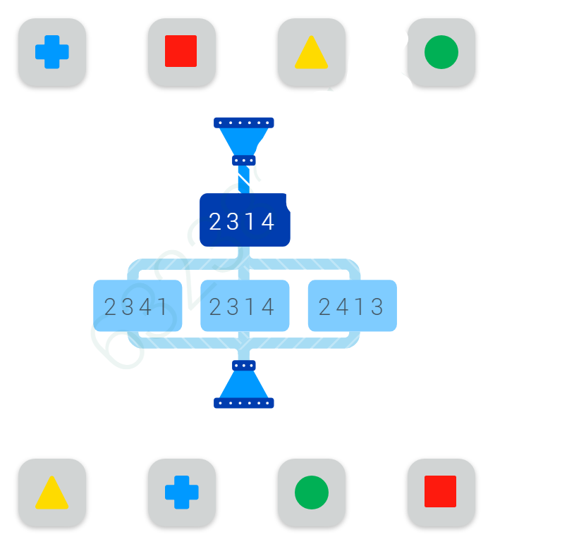

# Input Order Modifier Pipeline Problem

## Problem Description

We have a pipeline where the input consists of a series of shapes arranged in a certain order, indexed from left to right starting with 1.

At each stage of the pipeline, we encounter a modifier. The modifier takes the incoming shapes with their order and rearranges their order according to the modifier numbers. For example, a modifier `2,3,1,4` outputs a series of shapes where:
- The 1st item is the 2nd item of the input,
- The 2nd item is the 3rd item of the input,
- The 3rd item is the 1st item of the input,
- The 4th item remains the 4th item of the input.

Sometimes, you may have multiple options for a modifier, but only one modifier results in the correct output.

*in this diagram after the modifier 2314, modifier 2341 is the correct selection that produces the final output*
Your task is to find the missing parts of such a problem, whether that is finding which modifier results in the correct input/output, or determining what input/output fits correctly in the pipeline without conflict, etc.

## Solution

When I was presented with this problem, the scope was just to find which modifier works with the pipeline and produces the right output/input. However, I took it a step further and wrote a program that finds every missing piece in the diagram. These include any missing:
- Modifiers
- Bidirectional calculation of intermediate outputs/inputs after each modifier stage is complete
- Expected input or output given the pipeline

This program ensures that all parts of the pipeline are correctly identified and calculated, providing a comprehensive solution to the problem.